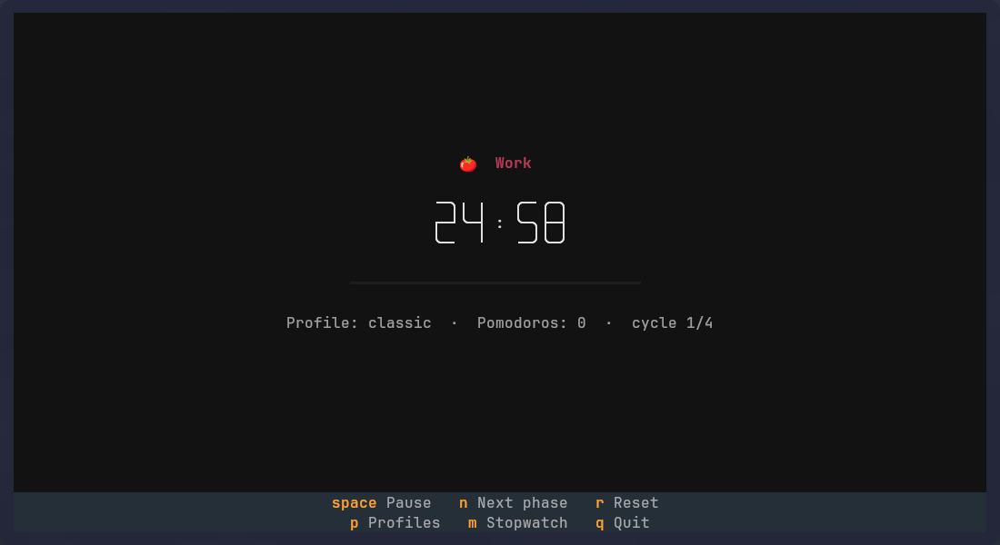
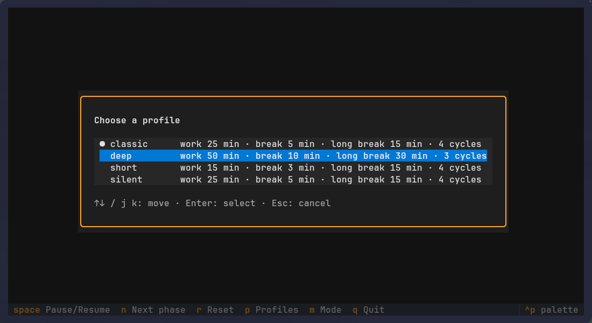
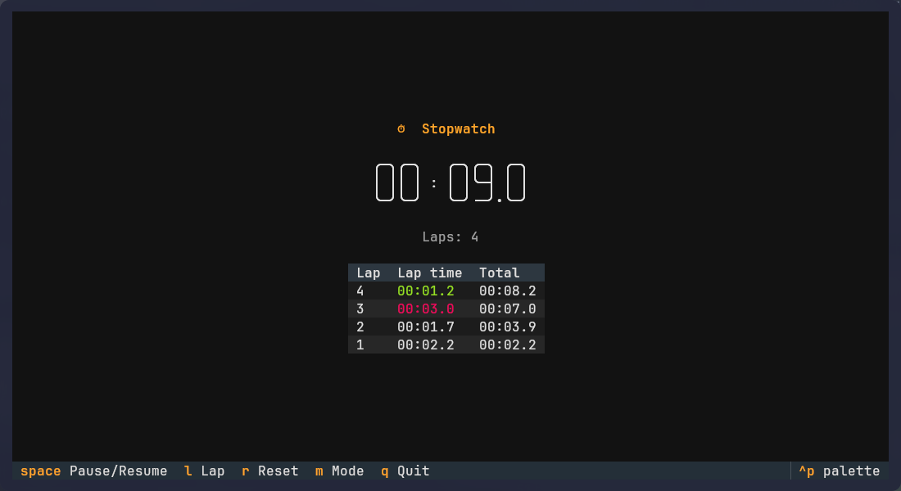

# pomo

Pomodoro TUI (Textual) that runs commands when work periods start and end
(default: pause/resume whatever media player is playing, through MPRIS), sends desktop
notifications and shows up in waybar.
It also has a stopwatch mode with laps.



> **AI disclosure:** this project was built with AI assistance. The code, scripts and
> documentation were largely written by Claude (Anthropic) through
> [Claude Code](https://claude.com/claude-code), following the author's requirements and
> direction. Review it as you would any other third-party code before relying on it.

Dependencies: `python-textual`, `libnotify`, `playerctl`, `waybar`. To control mpv, it needs
`mpv-mpris` (browsers, Spotify and most players expose MPRIS natively).

## Installation

```bash
./install.sh               # install (offers to install missing dependencies with pacman)
./install.sh --link        # symlinks to this directory (edits here take effect immediately)
./install.sh --no-waybar   # skip the waybar integration
./install.sh --force       # also overwrite an existing config.toml and waybar style
./install.sh --uninstall   # uninstall (~/.config/pomo is kept)
```

Without `--force`, an existing `config.toml` is never touched. `style.css` is backed up as
`*.bak-pomo` before being modified, and the script can be rerun safely without creating duplicates.

> **⚠ Required manual step: the waybar bar config.**
> The script **never modifies** the waybar bar file (`~/.config/waybar/bars/top-bar.jsonc`,
> or `~/.config/waybar/config.jsonc` depending on your setup). It installs the module, but
> adding it to the bar is up to you:
>
> 1. add the module to `include`:
>    ```jsonc
>    "include": [
>      ...
>      "~/.config/waybar/modules/custom-pomo.jsonc",
>    ],
>    ```
> 2. put `"custom/pomo"` wherever you like in `modules-left`, `modules-center` or `modules-right`:
>    ```jsonc
>    "modules-center": ["custom/music", "custom/pomo"],
>    ```
> 3. reload waybar: `pkill -SIGUSR2 waybar`
>
> When uninstalling, remove those two lines manually the same way.

### Manual installation

| Project file                         | Destination                                      |
|--------------------------------------|--------------------------------------------------|
| `bin/pomo`                           | `~/.local/bin/pomo`                              |
| `bin/pomo-media`                     | `~/.local/bin/pomo-media`                        |
| `config/pomo/config.toml`            | `~/.config/pomo/config.toml`                     |
| `waybar/scripts/pomo.py`             | `~/.config/waybar/scripts/pomo.py`               |
| `waybar/modules/custom-pomo.jsonc`   | `~/.config/waybar/modules/custom-pomo.jsonc`     |
| `waybar/pomo.css`                    | append to `~/.config/waybar/style.css`           |

Then do the manual bar config step described above.

## Usage

```bash
pomo                    # default profile
pomo -p deep            # profile "deep"
pomo -w 40 -s 8 -c 2    # work / short break / cycles (override the profile)
pomo -L                 # list profiles
pomo --on-work-start "CMD" --on-work-end "CMD"   # one-off hooks
pomo --no-hooks         # run no hook at all
pomo --lang en          # force the UI language
pomo --stopwatch        # start in stopwatch mode
```

Keys: `space` pause/resume · `n` next phase · `r` reset · `p` switch profile ·
`m` pomodoro/stopwatch mode · `l` lap (stopwatch) · `q` quit.
Waybar: click = pause/resume, right click = next phase (or lap in stopwatch mode).

The waybar module shows the remaining time (here: work running, work paused, short break,
stopwatch):


`p` opens a menu listing the profiles (the config file is reread, so profiles added while pomo
runs show up). Move with `↑`/`↓` or `j`/`k`, press `Enter` to load the profile, `Esc` to cancel.
Loading a profile resets the app as if it had just been launched with `-p NAME`: the timer and
pomodoro count start over, and CLI duration/hook overrides no longer apply (`--no-hooks` and
`--lang` are kept).



### Stopwatch mode

Press `m` (or launch with `--stopwatch`) to switch to a classic stopwatch; press `m` again to go
back to the pomodoro, which restarts fresh with the current profile.

- `space` starts / pauses, `l` records a lap, `r` resets the time and laps.
- The lap table lists the newest lap first with its lap time and total time; the fastest lap is
  shown in green, the slowest in red.
- The waybar module shows `⏱ MM:SS`; right click records a lap.
- No hooks or notifications run in stopwatch mode. Switching modes during a work period runs
  `on_work_end` with `POMO_EVENT=switch`.



## Configuration

`~/.config/pomo/config.toml`:

```toml
default_profile = "classic"
language = "auto"                 # auto | en | fr

[hooks]                           # applies to every profile
on_work_start = "pomo-media resume"
on_work_end = "pomo-media pause"

[profiles.classic]
work = 25                         # minutes
short_break = 5
cycles = 4                        # work sessions before the long break
long_break = 15                   # optional

[profiles.silent]                 # per-profile hook override
work = 25
short_break = 5
cycles = 4
on_work_start = ""
on_work_end = '[ "$POMO_EVENT" = pause ] || echo "end $POMO_PROFILE" >> ~/.local/state/pomo.log'
```

| Config key      | CLI option          | Default |
|-----------------|---------------------|---------|
| `work`          | `-w, --work`        | `25` |
| `short_break`   | `-s, --short-break` | `5`  |
| `long_break`    | `-l, --long-break`  | `15` |
| `cycles`        | `-c, --cycles`      | `4`  |
| `on_work_start` | `--on-work-start`   | `pomo-media resume` |
| `on_work_end`   | `--on-work-end`     | `pomo-media pause`  |
| `language`      | `--lang`            | `auto` |

Precedence: defaults < `[hooks]` < profile < CLI options. An empty string `""` disables a hook.

### Hooks

| Hook            | Runs when                                                                    |
|-----------------|------------------------------------------------------------------------------|
| `on_work_start` | a work period starts; the timer resumes during work                          |
| `on_work_end`   | work ends (naturally or with `n`); timer paused during work; `q`, profile or mode switch during work |

Environment variables passed to hooks:
`POMO_EVENT` (`start`/`resume` for the start hook, `end`/`pause`/`quit`/`switch` for the end hook),
`POMO_PROFILE`, `POMO_DONE` (completed pomodoros), `POMO_CYCLES`, `POMO_WORK_MIN`.

### Media control (`pomo-media`)

The default hooks call `pomo-media`, a small helper installed next to `pomo`:

```bash
pomo-media pause            # pause every MPRIS player that is playing, remember which ones
pomo-media resume           # resume only the players it paused
pomo-media pause mpv,chromium   # restrict to some players (names as in `playerctl -l`)
```

A player you paused yourself is never restarted, and music you start during a break keeps
playing. Run `playerctl -l` to see which players are visible; mpv only shows up with `mpv-mpris`.

## Localization

User-facing text (TUI, notifications, waybar tooltip, CLI help) is in English by default.
The language is resolved from `--lang`, then `$POMO_LANG`, then `language` in the config,
then the system locale (`LC_ALL`, `LC_MESSAGES`, `LANG`). Available: `en`, `fr`.

To add a language, add an entry to `TRANSLATIONS` in `bin/pomo` and `waybar/scripts/pomo.py`
(English strings are the keys).

## License

[MIT](LICENSE) © 2026 Charles-Henry Dufetel
